# A Data-Driven Analysis of Unemployment and Its Determinants in Jordan (2014–2024)

## Authors

* Tala Al-Hanini
* Majd Alqahwaje

## Supervisor

Dr. Husam Barham

## University

University of Petra – Faculty of Administration
Course: 307498 – Graduation Project
Second Semester: 2025/2026

---

# Table of Contents

1. [Abstract](#abstract)
2. [Business Intelligence Project Description and Objectives](#1-business-intelligence-project-description-and-objectives)
3. [Data Research and Acquisition](#2-data-research-and-acquisition)
4. [Data Description and Understanding](#3-data-description-and-understanding)
5. [Data Cleaning and Transformation](#4-data-cleaning-and-transformation)
6. [Data Visualization and Dashboard Design](#5-data-visualization-and-dashboard-design)
7. [Advanced Analytics and Modeling](#6-advanced-analytics-and-modeling)
8. [Clustering and PCA Analysis](#7-clustering-and-pca-analysis)
9. [Tools Used](#8-tools-used)
10. [Results](#9-results)
11. [Conclusion and Recommendations](#10-conclusion-and-recommendations)
12. [Repository Structure](#11-repository-structure)
13. [How to Run the Project](#12-how-to-run-the-project)
14. [Documentation File](#13-documentation-file)
15. [Reports and Presentation](#14-reports-and-presentation)
16. [Dashboards and Visual Outputs](#15-dashboards-and-visual-outputs)
17. [Academic Purpose](#16-academic-purpose)

---

# Abstract

This graduation project presents a data-driven analysis of unemployment in Jordan and its socioeconomic determinants during the period 2014–2024. The study focuses on unemployment patterns across the 12 Jordanian governorates and investigates how economic, demographic, and educational indicators are related to unemployment rates.

The project uses official Jordanian data sources and applies Business Intelligence, statistical modeling, and machine learning techniques. Python was used for data cleaning, transformation, regression modeling, validation, clustering, and output generation. Tableau was used to create interactive dashboards that visualize unemployment trends and key determinants.

The main analytical methods used in this project include Panel Data Analysis, Pooled OLS Regression, Fixed Effects Regression, Leave-One-Year-Out Validation, Variance Inflation Factor Analysis, Principal Component Analysis, K-Means Clustering, and Hierarchical Clustering.

The results showed that Fixed Effects regression performed better than Pooled OLS, confirming that governorate-specific differences are important when analyzing unemployment in Jordan. Clustering also showed that governorates can be grouped into two main socioeconomic patterns.

**Keywords:** Unemployment, Jordan, Panel Data, Fixed Effects, Pooled OLS, LOYO, VIF, PCA, K-Means, Hierarchical Clustering, Tableau, Business Intelligence, Machine Learning.

---

# 1. Business Intelligence Project Description and Objectives

## 1.1 Project Description

This project is a Business Intelligence and data analytics project that analyzes unemployment in Jordan from 2014 to 2024. The main goal is to understand unemployment patterns across Jordanian governorates and identify socioeconomic factors associated with unemployment.

Unemployment is one of the most important labor market challenges in Jordan. It affects economic growth, household income, youth opportunities, social stability, and regional development. Since unemployment differs across governorates and changes over time, a data-driven approach was needed to study the issue more clearly.

The project combines statistical modeling, machine learning, and visualization to transform raw data into meaningful insights.

## 1.2 Project Objectives

The project objectives are:

* Analyze unemployment trends in Jordan from 2014 to 2024.
* Study unemployment across the 12 Jordanian governorates.
* Identify economic, demographic, and educational indicators related to unemployment.
* Apply Panel Data Regression using Pooled OLS and Fixed Effects.
* Use VIF to check multicollinearity between regression variables.
* Validate the model using Leave-One-Year-Out validation.
* Apply PCA and clustering to group governorates by socioeconomic similarity.
* Build Tableau dashboards to support visualization and decision-making.

---

# 2. Data Research and Acquisition

## 2.1 Data Sources

The dataset was prepared using official Jordanian sources:

| Source                                                           | Data Used                                                                 |
| ---------------------------------------------------------------- | ------------------------------------------------------------------------- |
| [Jordan Department of Statistics](https://dosweb.dos.gov.jo/ar/) | Unemployment, employment, labor force, population, demographic indicators |
| [Social Security Corporation](https://www.ssc.gov.jo/)           | Number of establishments                                                  |
| [Ministry of Education](https://moe.gov.jo/ar/reports)           | Schools, students, classes, and education indicators                      |
| Structured Excel Dataset                                         | Final combined dataset prepared by the project team                       |

## 2.2 Source Importance

The Jordan Department of Statistics was the main source for labor market and population indicators.
The Social Security Corporation was used to obtain establishments data, which represents economic activity and potential job creation.
The Ministry of Education was used for education-related indicators such as number of schools, students, classes, and students per class.

These sources were selected because they provide official data suitable for governorate-level analysis.

---

# 3. Data Description and Understanding

## 3.1 Dataset Overview

The dataset is a panel dataset covering Jordanian governorates between 2014 and 2024. Each row represents one governorate observed in one year.

The main target variable is:

* **Unemployment Rate**

The dataset also includes socioeconomic explanatory variables related to economic activity, population pressure, and educational infrastructure.

## 3.2 Panel Data Structure

Panel Data combines:

* **Cross-sectional dimension:** Jordanian governorates
* **Time dimension:** Years from 2014 to 2024

This structure allows the project to analyze both regional differences and changes over time.

Example:

| Governorate | Year | Unemployment Rate |
| ----------- | ---: | ----------------: |
| Amman       | 2014 |             Value |
| Amman       | 2015 |             Value |
| Irbid       | 2014 |             Value |
| Irbid       | 2015 |             Value |

## 3.3 Main Variables

| Variable                                 | Description                          | Importance                              |
| ---------------------------------------- | ------------------------------------ | --------------------------------------- |
| Unemployment Rate                        | Percentage of unemployed individuals | Main target variable                    |
| Employment Rate                          | Percentage of employed individuals   | Labor market indicator                  |
| Population Density                       | Population pressure indicator        | Demographic dimension                   |
| Establishments per 1,000 people aged 15+ | Business activity indicator          | Economic dimension                      |
| Schools per 1,000 Population             | School availability indicator        | Education dimension                     |
| Students per Class                       | Average students per class           | Education capacity indicator            |
| Student Ratio 5–19                       | Student participation indicator      | Education-related demographic indicator |

## 3.4 Selected Regression Features

The final regression features were:

1. Establishments per 1,000 people aged 15 and above.
2. Population Density.
3. Schools per 1,000 population.

These variables were selected because they represent three important dimensions:

* Economic activity
* Demographic pressure
* Educational infrastructure

They were also checked using VIF and showed no severe multicollinearity.

---

# 4. Data Cleaning and Transformation

Python was used to clean and prepare the dataset.

The main cleaning steps included:

* Loading the Excel dataset.
* Renaming columns.
* Converting data types.
* Handling missing values.
* Creating derived indicators.
* Selecting relevant features.
* Creating the Year Squared variable.
* Standardizing variables for clustering.
* Exporting cleaned outputs.

## 4.1 Derived Indicators

Some indicators were calculated using formulas because they were not directly available in the raw data.

For the years 2014–2016, some population age data was available as percentages only. Therefore, actual values were calculated using:

```text
Population +15 = Total Population × Population +15 Rate / 100
```

Excel formula:

```excel
=Table3[@[Total Population]]*(Table3[@[population +15 Rate]]/100)
```

Other derived indicators included:

* Population Density
* Schools per 1,000 Population
* Students per School
* Students per Class
* Classes per School
* Establishments per 1,000 people aged 15+
* Labor Force-related indicators

These ratios helped make comparison between governorates fairer because raw counts can be misleading when governorates have different population sizes.

---

# 5. Data Visualization and Dashboard Design

Tableau was used to create two dashboards.

## 5.1 Dashboard 1: Labor Market Overview

This dashboard answers:

**What is happening in Jordan’s labor market?**

It shows:

* Unemployment trend over time.
* Governorate-level comparison.
* Geographic distribution.
* Employment and unemployment profiles.
* Interactive filters.

Main insight:

Unemployment differs across governorates and changes over time. This confirms that unemployment is both a regional and time-based issue.

## 5.2 Dashboard 2: Key Factors Affecting Unemployment

This dashboard answers:

**Why is unemployment happening?**

It shows relationships between unemployment and:

* Establishments per 1,000 people aged 15+
* Population Density
* Schools per 1,000 Population
* Model coefficients

Main insight:

Unemployment is connected to a combination of economic, demographic, and educational indicators.

---

# 6. Advanced Analytics and Modeling

## 6.1 Methods Used

The project applied the following analytical methods:

* Pooled OLS Regression
* Fixed Effects Regression
* Leave-One-Year-Out Validation
* Variance Inflation Factor Analysis
* Residual Diagnostics
* Principal Component Analysis
* K-Means Clustering
* Hierarchical Clustering

## 6.2 VIF Analysis

Variance Inflation Factor was used to check multicollinearity between independent variables.

```text
VIF = 1 / (1 - R²)
```

The selected regression variables showed acceptable VIF levels, meaning they were suitable to be used together in the regression model.

## 6.3 Pooled OLS Regression

Pooled OLS was used as the baseline model. It estimates one general relationship between unemployment and the selected explanatory variables.

| Metric | Value |
| ------ | ----: |
| R²     | 0.281 |
| RMSE   | 3.586 |
| MAE    | 2.955 |

Interpretation:

Pooled OLS captured some general patterns, but its explanatory power was limited because it does not control for governorate-specific differences.

## 6.4 Fixed Effects Regression

Fixed Effects was used because the dataset is panel data. This model controls for unobserved governorate-specific characteristics.

Examples of governorate-specific characteristics include:

* Local economic structure
* Infrastructure
* Population characteristics
* Labor market conditions
* Geographic location

| Metric | Value |
| ------ | ----: |
| R²     | 0.847 |
| RMSE   | 1.657 |
| MAE    | 1.306 |

Interpretation:

Fixed Effects performed better than Pooled OLS, confirming that regional differences are important in unemployment analysis.

## 6.5 Leave-One-Year-Out Validation

LOYO validation was used to test whether the model can generalize across years.

Process:

```text
Remove one year
      ↓
Train on remaining years
      ↓
Predict excluded year
      ↓
Repeat for all years
```

Overall result:

| Metric | Value |
| ------ | ----: |
| R²     | 0.692 |

Interpretation:

The model showed acceptable temporal generalization and was not only fitting the training data.

---

# 7. Clustering and PCA Analysis

## 7.1 Clustering Purpose

Clustering was used to group governorates based on socioeconomic similarity.

The clustering features included:

* Unemployment Rate
* Establishments per 1,000 people aged 15+
* Population Density
* Students per Class
* Schools per 1,000 Population
* Student Ratio 5–19

## 7.2 PCA

PCA was used to reduce multiple clustering variables into two principal components for visualization.

```text
PC1 = a1X1 + a2X2 + a3X3 + ... + anXn
```

PCA helped visualize governorates in a two-dimensional space while preserving the most important variation in the data.

## 7.3 K-Means and Hierarchical Clustering

K-Means was used to group governorates into clusters.
Hierarchical Clustering was used to show similarity relationships using a dendrogram.

The best number of clusters was selected using:

* Elbow Method
* Silhouette Score

Final result:

```text
Best number of clusters = 2
```

This means that Jordanian governorates can be grouped into two main socioeconomic patterns.

---

# 8. Tools Used

| Tool / Library | Purpose                                                 |
| -------------- | ------------------------------------------------------- |
| Excel          | Data organization and derived calculations              |
| Python         | Cleaning, modeling, validation, clustering, and outputs |
| Pandas         | Data manipulation                                       |
| NumPy          | Numerical calculations                                  |
| Statsmodels    | Regression modeling and diagnostics                     |
| Scikit-learn   | Scaling, PCA, K-Means, metrics                          |
| SciPy          | Hierarchical clustering                                 |
| Matplotlib     | Figures and visual diagnostics                          |
| Tableau        | BI dashboards                                           |
| GitHub         | Documentation and project sharing                       |

---

# 9. Results

## 9.1 Model Comparison

| Model           |    R² |  RMSE |   MAE | Interpretation                                |
| --------------- | ----: | ----: | ----: | --------------------------------------------- |
| Pooled OLS      | 0.281 | 3.586 | 2.955 | Baseline model with limited explanatory power |
| Fixed Effects   | 0.847 | 1.657 | 1.306 | Best in-sample model                          |
| LOYO Validation | 0.692 |     — |     — | Acceptable temporal generalization            |

## 9.2 Main Findings

The main findings of the project are:

* Unemployment varies clearly across Jordanian governorates.
* Fixed Effects performed better than Pooled OLS.
* Governorate-specific differences are important in explaining unemployment.
* Economic activity, population density, and education indicators are related to unemployment.
* Clustering revealed two main socioeconomic patterns among governorates.
* Tableau dashboards improved interpretation and decision support.

---

# 10. Conclusion and Recommendations

## 10.1 Conclusion

This project showed that unemployment in Jordan should not be treated as one uniform national issue. It differs across governorates and changes over time.

The Fixed Effects model confirmed that regional differences matter. The clustering analysis also showed that governorates can be grouped into two main socioeconomic patterns.

Overall, the project demonstrates how Business Intelligence, statistical modeling, and machine learning can support unemployment analysis and data-driven decision-making.

## 10.2 Recommendations

Based on the findings, the following recommendations are suggested:

* Create governorate-specific employment policies.
* Encourage investment in high-unemployment areas.
* Support establishments and small businesses outside the capital.
* Improve alignment between education programs and labor market needs.
* Use BI dashboards for continuous monitoring and decision-making.
* Expand future analysis using additional indicators such as wages, GDP, inflation, youth unemployment, and gender unemployment.

---

# 11. Repository Structure

```text
Graduationproject/
├── README.md
├── docs/
│   └── documentation.md
│
├── data/
│   ├── raw/
│   └── processed/
│
├── src/
│   └── ROUND2.py
│
├── dashboards/
├── images/
├── reports/
├── models/
├── requirements.txt
└── .gitignore
```

---

# 12. How to Run the Project

Install the required libraries:

```bash
pip install -r requirements.txt
```

Run the analysis script:

```bash
python src/ROUND2.py
```

---

# 13. Documentation File

The full project documentation is available in one Markdown file:

* [Project Documentation](docs/documentation.md)

This file includes the project description, objectives, data research, data description, data cleaning and transformation, dashboard design, advanced analytics, modeling, tools selection, deployment use case, results, and references.

---

# 14. Reports and Presentation

The final report and presentation are available in the `reports/` folder:

* [Final Report - Word](reports/Data-Driven%20Analysis%20of%20Unemployment%20in%20Jordan%20and%20Its%20Socioeconomic%20Determinants%20%282014%E2%80%932024%29%20final.docx)
* [Final Report - PDF](reports/Data-Driven%20Analysis%20of%20Unemployment%20in%20Jordan%20and%20Its%20Socioeconomic%20Determinants%20%282014%E2%80%932024%29%20%281%29.pdf)
* [Presentation - PDF](reports/A%20Data-Driven%20Analysis%20of%20Unemployment%20and%20Its%20Determinants%20in%20Jordan%20presentation.pdf)

---

# 15. Dashboards and Visual Outputs

This section provides clickable dashboard screenshots and generated analytical figures.

## 15.1 Tableau Dashboards

### Figure 9.1: Dashboard 1 – Labor Market Overview

[](dashboards/Screenshot%202026-05-20%20174621.png)

This dashboard answers the question: **What is happening in Jordan’s labor market?**

---

### Figure 9.2: Dashboard 2 – Key Factors Affecting Unemployment

[](dashboards/Screenshot%202026-05-20%20174647.png)

This dashboard answers the question: **Why is unemployment happening?**

---

## 15.2 Regression Figures

### Figure 10.1: Pooled OLS Actual vs Predicted

[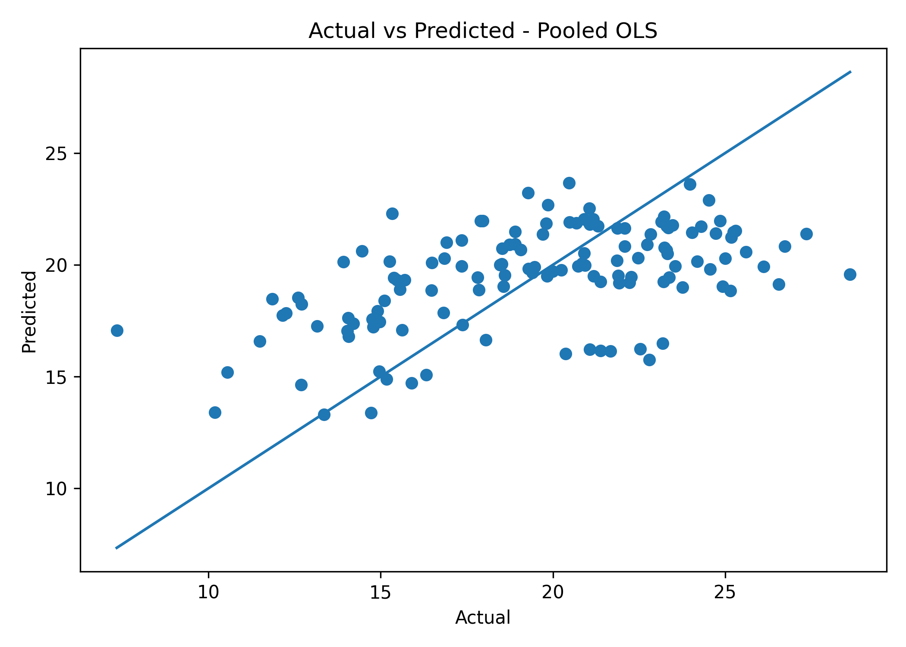](images/pooled_actual_vs_predicted.png)

### Figure 10.2: Pooled OLS Residuals

[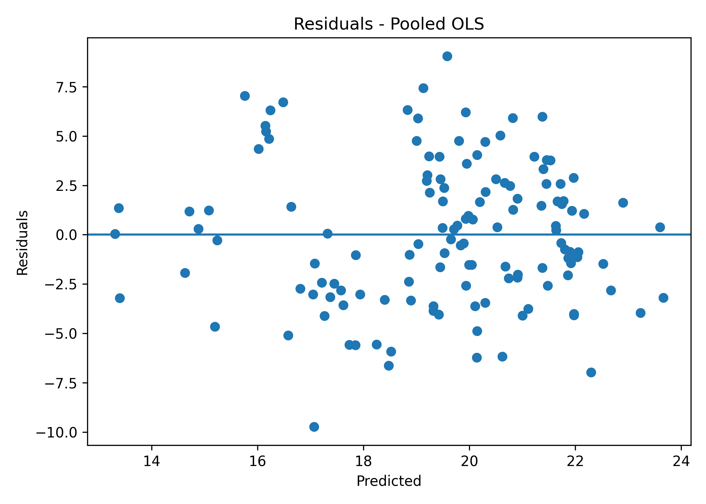](images/pooled_residuals.png)

### Figure 10.3: Fixed Effects Actual vs Predicted

[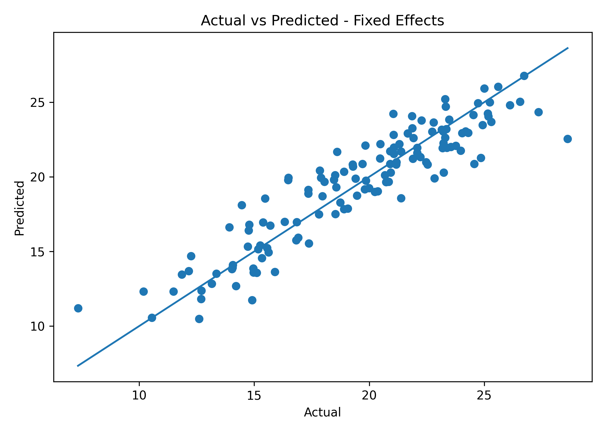](images/fe_actual_vs_predicted.png)

### Figure 10.4: Fixed Effects Residuals

[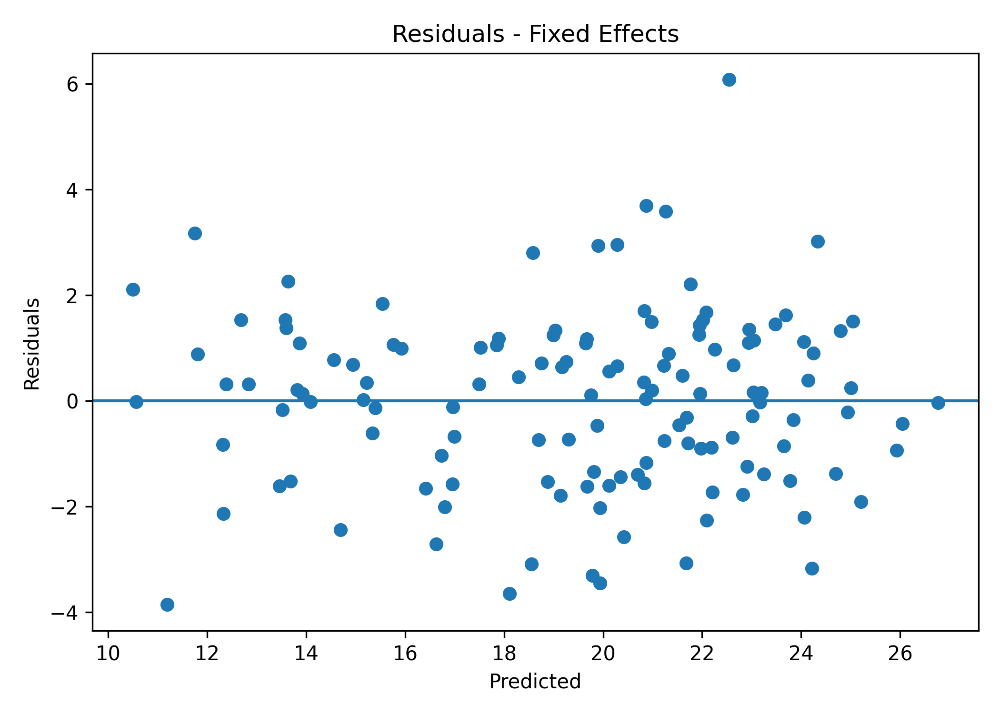](images/fe_residuals.png)

### Figure 10.5: Fixed Effects Base Coefficients

[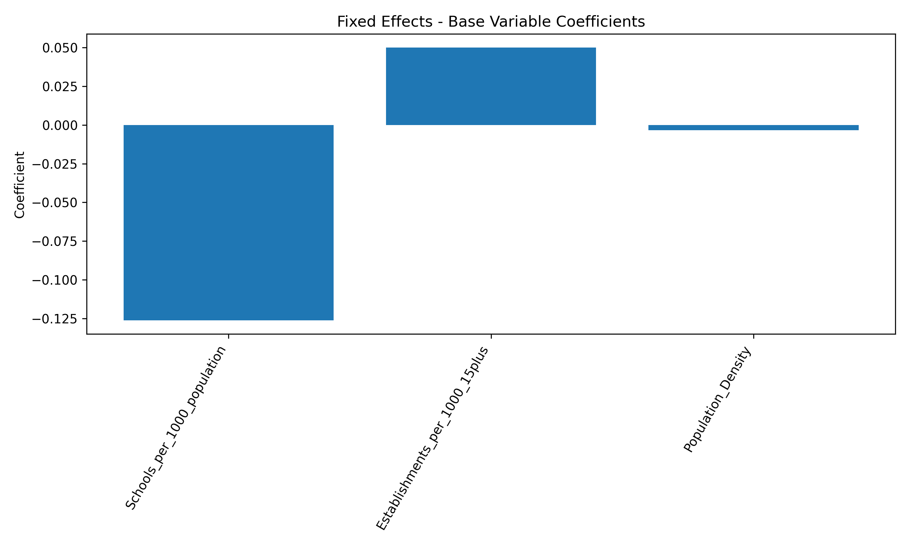](images/fixed_effects_base_coefficients.png)

### Figure 10.6: LOYO Actual vs Predicted

[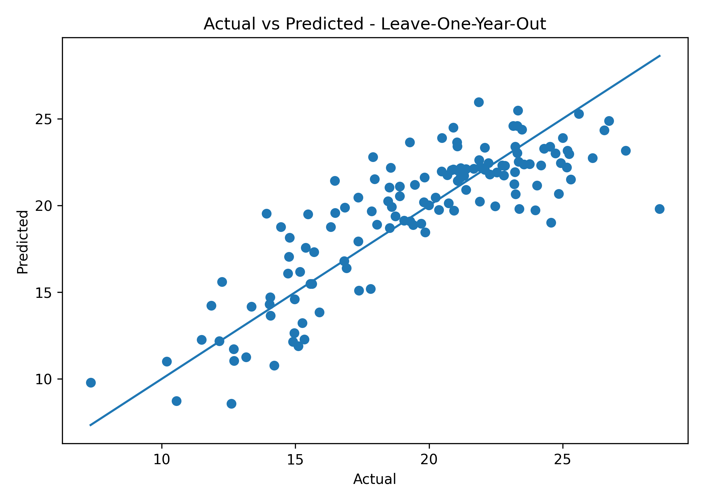](images/loyo_actual_vs_predicted.png)

### Figure 10.7: LOYO Residuals

[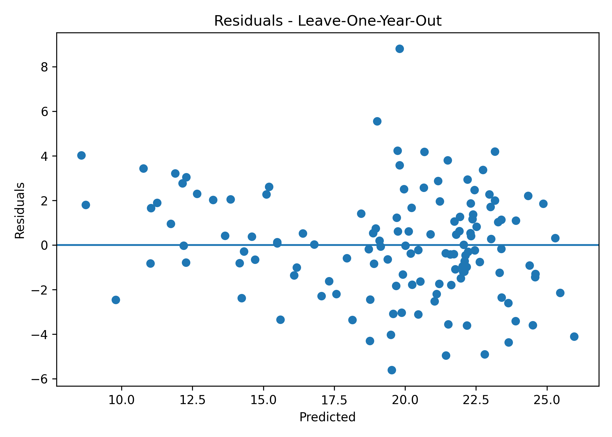](images/loyo_residuals.png)

---

## 15.3 Clustering and PCA Figures

### Figure 11.1: Clustering Elbow Method

[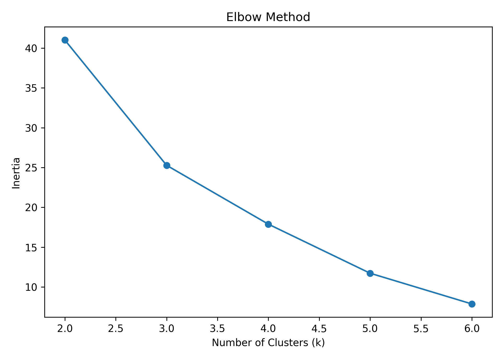](images/clustering_elbow_method.png)

### Figure 11.2: Clustering Silhouette Scores

[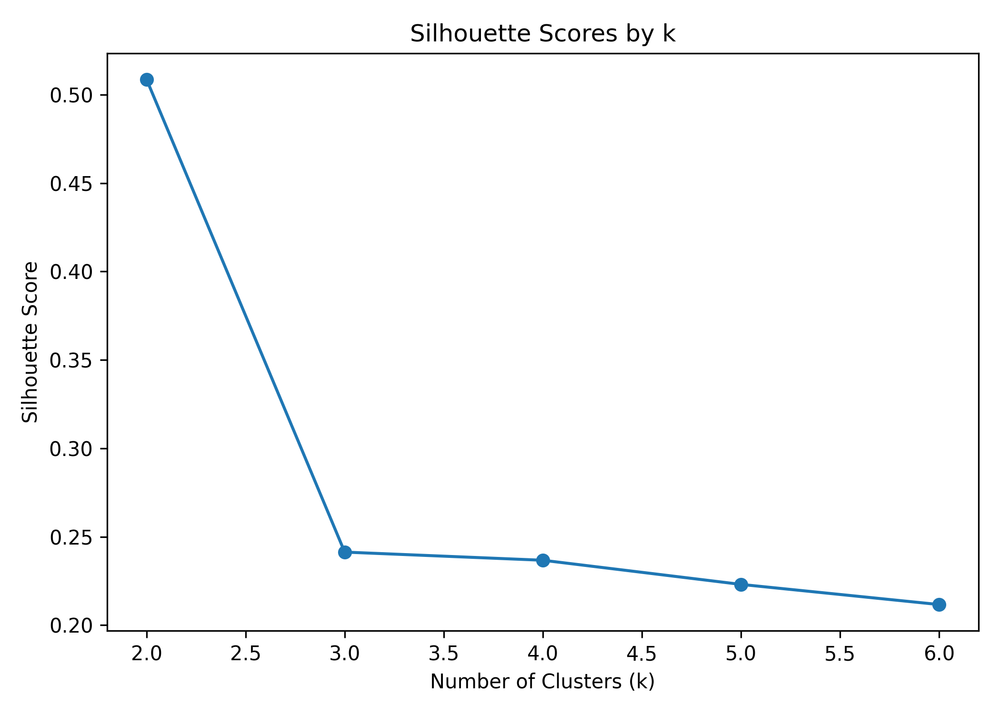](images/clustering_silhouette_scores.png)

### Figure 11.3: Governorates Clusters PCA

[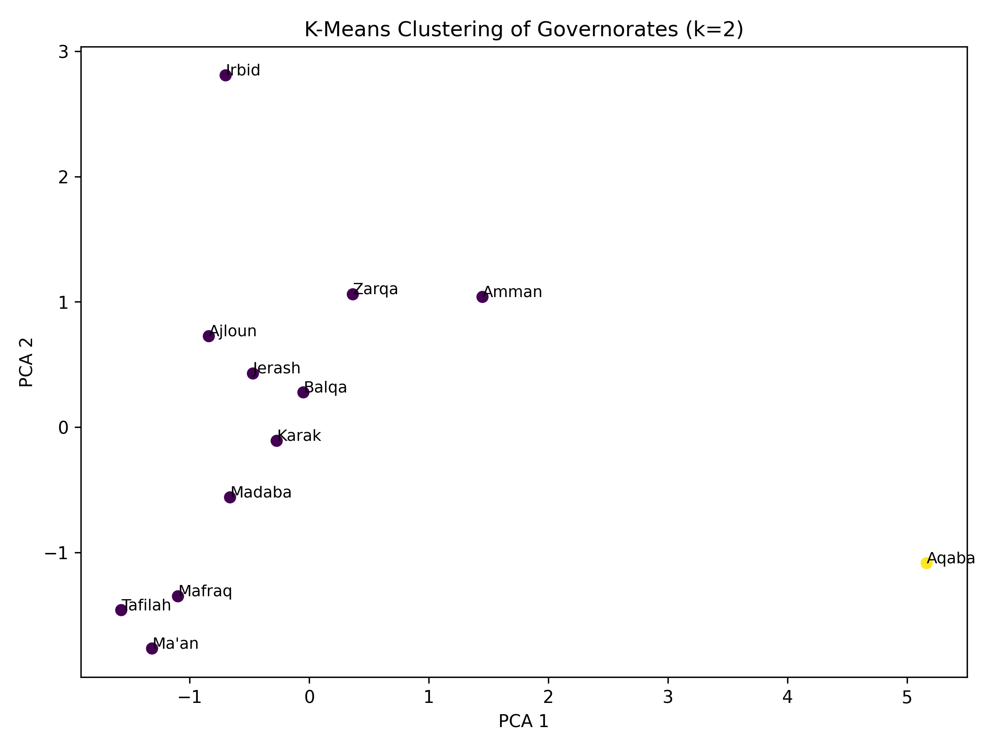](images/governorates_clusters_pca.png)

### Figure 11.4: Hierarchical Dendrogram

[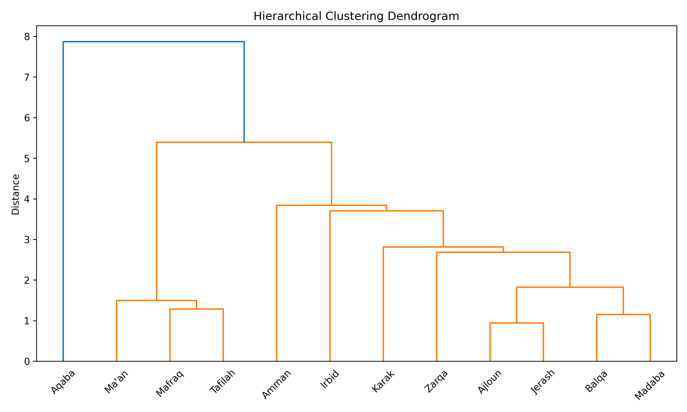](images/hierarchical_dendrogram.png)

---

# 16. Academic Purpose

This project was prepared for academic purposes as part of the Graduation Project course at the University of Petra.
